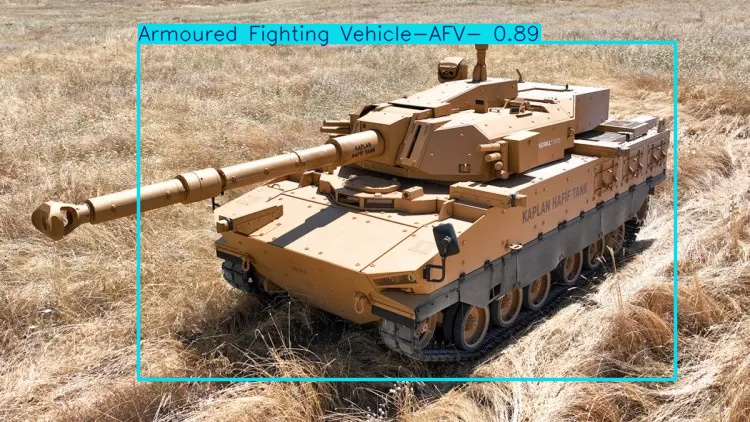
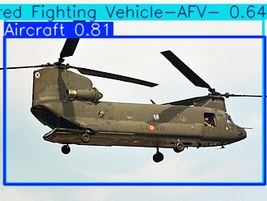
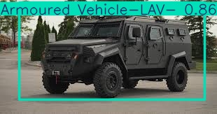

# Military Vehicle Detection and Classification System

AI-powered military vehicle detection and classification system using YOLOv8, trained on aerial and satellite imagery to identify 5 types of military vehicles.

## Demo

<p align="center">
  
  
</p>
<p align="center">
  
</p>

## Performance

| Class | Description | mAP50 |
|-------|------------|-------|
| Aircraft | Military aircraft/helicopters | 78.0% |
| AFV (Armoured Fighting Vehicle) | Tanks, armoured combat vehicles | 71.3% |
| APC (Armoured Personal Carrier) | Troop transport vehicles | 80.0% |
| LAV (Light Armoured Vehicle) | Light reconnaissance vehicles | 87.9% |
| MEV (Military Engineering Vehicle) | Engineering/support vehicles | 90.3% |
| **Overall** | **All classes** | **81.5%** |

## Features

- **Real-time Detection** — YOLOv8 model with ONNX optimization (21ms inference)
- **REST API** — FastAPI service with Swagger documentation
- **Web Dashboard** — Streamlit-based interactive UI
- **Video Processing** — Frame-by-frame detection on video files
- **Object Tracking** — ByteTrack multi-object tracking
- **Docker Support** — One-command deployment

## Tech Stack

- **Model:** YOLOv8n + ONNX Runtime
- **Training:** Google Colab, Tesla T4 GPU, 50 epochs
- **Dataset:** 2,794 annotated military vehicle images (Roboflow)
- **API:** FastAPI + Uvicorn
- **Frontend:** Streamlit
- **Deployment:** Docker
- **Language:** Python 3.11

## Quick Start

### Docker (Recommended)

```bash
docker build -t military-vehicle-detection .
docker run -p 8000:8000 military-vehicle-detection
```

Then open http://localhost:8000/docs

### Local Installation

```bash
git clone https://github.com/kurkcudeniz/military-vehicle-detection.git
cd military-vehicle-detection
pip install -r requirements.txt
```

### Run Detection

```bash
python src/detect.py path/to/image.jpg --conf 0.3
```

### Run API

```bash
uvicorn src.api:app --host 0.0.0.0 --port 8000
```

### Run Dashboard

```bash
streamlit run src/app.py
```

### Run Video Detection

```bash
python src/video_detect.py path/to/video.mp4
```

### Run Live Camera

```bash
yolo predict model=models/best.onnx source=0 show=True conf=0.5
```

## API Endpoints

| Method | Endpoint | Description |
|--------|----------|-------------|
| GET | `/` | Service info |
| POST | `/detect` | JSON detection results |
| POST | `/detect/visual` | Annotated image |

## Project Structure

```
military-vehicle-detection/
├── models/
│   ├── best.pt               # PyTorch model
│   └── best.onnx             # Optimized ONNX model
├── src/
│   ├── detect.py              # CLI detection
│   ├── api.py                 # FastAPI service
│   ├── app.py                 # Streamlit dashboard
│   └── video_detect.py        # Video processing
├── results/                   # Detection outputs
├── Dockerfile
├── requirements.txt
└── README.md
```

## Training Details

- **Base Model:** YOLOv8n (pretrained on COCO)
- **Epochs:** 50
- **Image Size:** 640x640
- **Batch Size:** 16
- **Training Time:** ~18 min on Tesla T4
- **Optimization:** ONNX export with dynamic input

## Author

**Deniz Kurkcu** — AI/ML Engineer | Computer Vision & Defense Technology

- [GitHub](https://github.com/kurkcudeniz)
- [LinkedIn](https://linkedin.com/in/kurkcudeniz)

## License

MIT License
